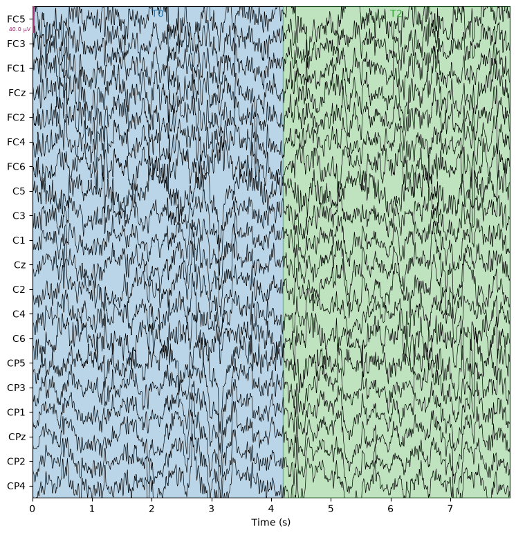
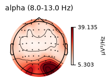
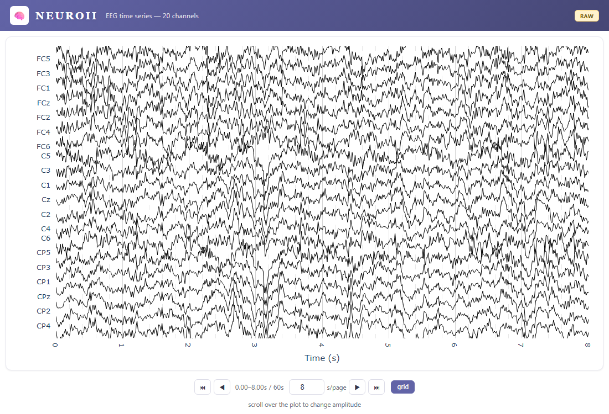
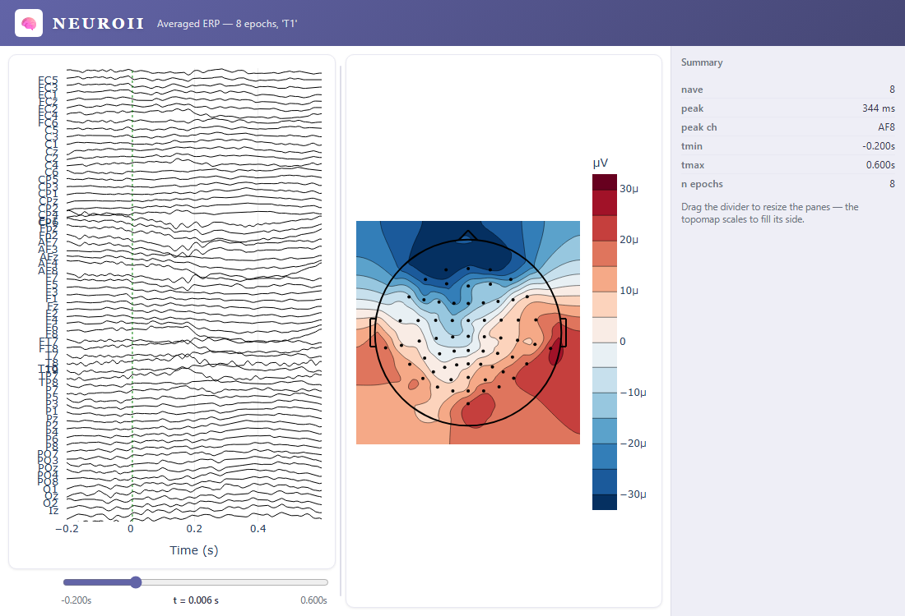
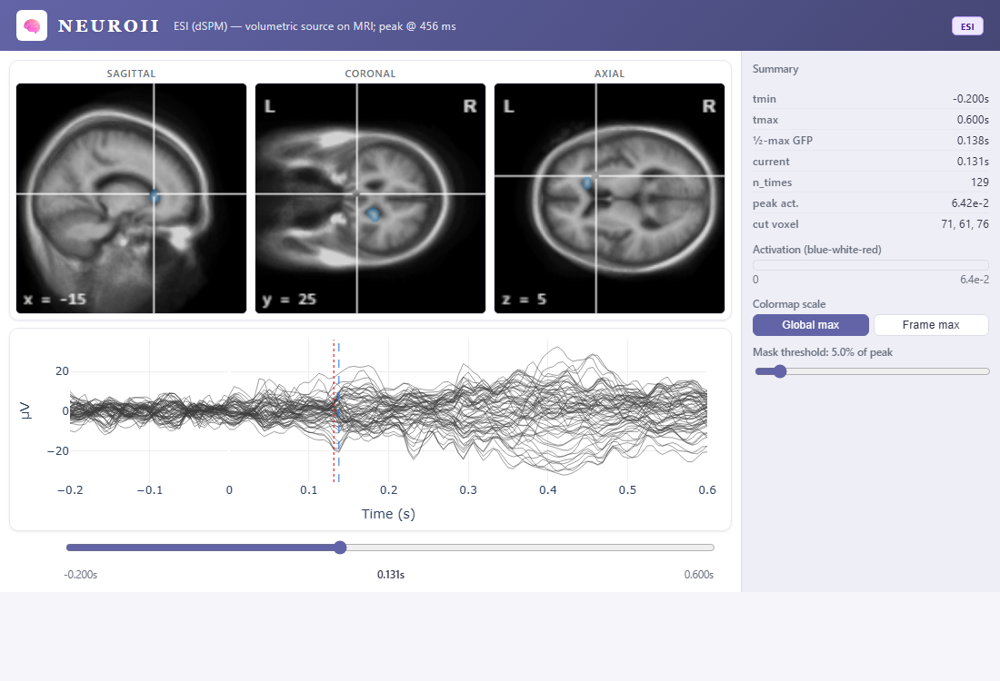

# Tutorial: A Clinician's First EEG Review

*No coding experience needed for this page.* Everything below is written from
the point of view of a doctor working through an AI assistant (an "agent")
that has neuro-mcp connected — you just talk to it in plain English. The
technical tool names appear alongside each step only so a curious reader can
see what's happening under the hood; you'd never need to type them yourself.

If you're an engineer building that agent, the [Examples overview](index.md)
and the raw call sequences in the other five pages are written for you
instead — this page is the "what does it feel like to use" version.

!!! note "About this recording"
    Every screenshot on this page is a **real result from real human EEG** —
    not simulated data. We used a public, de-identified recording from the
    [PhysioNet EEG Motor Movement/Imagery Dataset](https://physionet.org/content/eegmmidb/1.0.0/)
    (64 channels, subject performing real left/right hand movements on cue),
    fetched automatically through MNE-Python. "Jane" is a fictional patient
    name we've attached to it purely for this walkthrough — there's no real
    epilepsy case or diagnosis here, just genuine EEG physiology so the
    numbers and images below are real, not made up.

---

## 1. Add the patient

> 🗣 **You:** *"Add a new patient, Jane, born April 2nd 1985."*

The system creates a record for Jane. Behind the scenes this is one call —
`register_subject` — but you'd just see a confirmation:

> ✓ *Patient added: Jane D. (b. 1985-04-02)*

## 2. Bring in her EEG recording

> 🗣 **You:** *"Load in the EEG we just recorded for Jane."*

One request does three things at once: it files the recording under Jane's
name, stores it safely, and opens it up so it's ready to look at.

> ✓ *Recording loaded — 64 channels, just over 2 minutes.*

## 3. Look at the raw signal

> 🗣 **You:** *"Show me the raw traces."*

Each horizontal line is one electrode's signal over time — the squiggly
pattern is normal, ongoing brain electrical activity. The shaded bands aren't
added for this tutorial — they're real markers from the recording itself,
timestamping moments the technician logged during the session. Nothing here
is diagnostic on its own; it's the equivalent of glancing at the raw feed
before doing any analysis.

## 4. Clean up the noise

> 🗣 **You:** *"Clean this up — there's some noise in it."*

This is where the agent has to do some translating for you: "clean this up"
isn't a setting the software has a button for, so it converts your request
into a standard band-pass filter (keeping the frequencies that matter for EEG,
roughly 1–40 Hz) and removes electrical hum from nearby power lines. You don't
see any of this — you'd just get:

> ✓ *Recording filtered.*

## 5. See which brain rhythms are active

> 🗣 **You:** *"What does her alpha activity look like?"*

This is a **topomap** — a top-down map of the head showing how strong a
particular brain rhythm is at each electrode. Darker red means stronger. Here
it's mapping **alpha waves** (8–13 Hz). Worth knowing: alpha isn't always the
loudest rhythm in a recording — which one dominates depends heavily on what
the patient is doing at the time (resting quietly vs. moving vs. eyes open or
closed). The topomap tool works the same way regardless of which band you ask
for; you could just as easily ask about beta, theta, or delta activity.

## 6. Get an interactive viewer to scroll through

> 🗣 **You:** *"Give me something I can scroll through myself."*

This opens as a normal web page — no special software needed, and it works
offline. The arrow buttons page forward and backward through the recording,
the box lets you change how many seconds are shown at once, and scrolling
your mouse over the traces zooms the amplitude in or out.

!!! tip "Where did that file go?"
    Every one of these interactive views (this one, the averaging view in the
    next step, and the brain view in step 8) is saved as a single file on
    disk — the agent always tells you exactly where. If you're not sure, just
    ask: *"where did you save that?"* By default it lands in a `viz` folder
    next to where your recordings are stored, named after what it shows —
    e.g. `averaging_jane.html`. Once you have that path, you can double-click
    the file, or drag it into any browser tab, any time — no need to ask the
    agent to reopen it for you.

## 7. Average her responses to a repeated task

> 🗣 **You:** *"She was asked to clench her left fist several times during
> this recording — average those moments together."*

The recording contains 8 separate moments where she performed that exact
task. Averaging them together cancels out random background noise and
reveals a consistent, repeatable pattern tied specifically to that action.
The panel on the right shows *when* the strongest change happens (**344 ms**
after she began the movement) and *which* electrode picked it up most
clearly (**AF8**, near the front of the head). Drag the slider under the left
panel and watch the map on the right update — it shows *where on the scalp*
the activity was strongest at that exact moment.

## 8. Find where in the brain it's coming from

> 🗣 **You:** *"Show me where in her brain this activity is coming from,
> overall."*

This is the most advanced view: instead of just showing activity at the
scalp, it estimates *which part of the brain* produced it and displays that
on three MRI cross-sections (side, front-to-back, and top-down views). No
personal MRI scan is required — the system uses a standard reference brain.
This particular view averages across the *whole* recording rather than one
specific task, so think of it as a broader summary rather than the same
left-fist moment from the step above. The colored patch shows where the
estimated activity is strongest; the slider under the ERP plot lets you step
through time and watch it move.

> ✓ *"Averaged across the whole recording, activity peaks about 456 ms in,
> localized to the left hemisphere."*

## 9. Write your finding into the chart

> 🗣 **You:** *"Mark a note here: clear frontal response during the left-hand
> task. Add a routine entry to her chart — no abnormal findings on this
> recording."*

This adds a timestamped annotation directly on the recording, and separately
adds an entry to Jane's medical record — both attributed to you and logged
for audit, exactly like a real chart entry. Nothing is ever silently
overwritten: if you correct the note later, the original stays on file too
(see [Clinical Review, Annotation & EHR Audit](clinical-review-ehr-audit.md)
for the full version of this, using its own separate recording).

---

## That's the whole loop

Nine plain-English requests took you from a raw recording to a source-imaging
result and a chart entry — no code, no file paths, no parameter tuning. Every
screenshot on this page came from a real, working run of neuro-mcp against
real human EEG (see [Testing & Verification](../testing.md) if you're curious
how that's checked).

If you want to see the actual tool calls behind each of these steps, or you're
building the agent that sits between a doctor and this software, continue to
the other [Examples](index.md) — they show the same workflows from the
engineering side.
