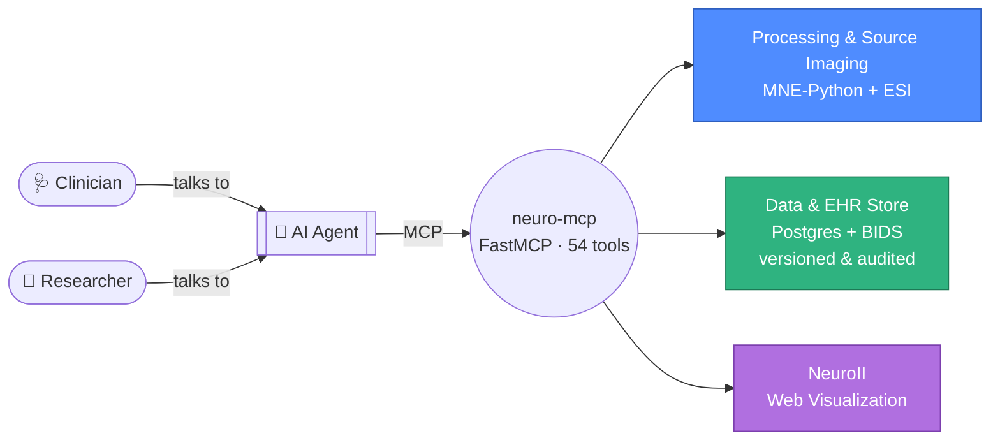

# 🧠 neuro-mcp

### An MCP for NeuroAgents that assist clinicians and researchers

**[GitHub](https://github.com/AImplifier/neuro-mcp)** · **[PyPI](https://pypi.org/project/neuro-mcp/)** · **[Tutorial](examples/tutorial-first-eeg-review.md)** · **[Tool Reference](tools/index.md)**

It gives an AI agent one interface over the whole clinical/research EEG
workflow: signal processing and source imaging (via
[MNE-Python](https://mne.tools)), a persistent dataset + **EHR** store
(Postgres + [BIDS](https://bids.neuroimaging.io)), and **NeuroII** web
visualization.

The FastMCP server is named `neuro-analysis` and exposes **54 tools** across
five areas.

## Concept

A clinician or researcher never calls a tool directly — they talk to an
agent in plain English, and the agent drives neuro-mcp's 54 tools underneath.
See the [Tutorial](examples/tutorial-first-eeg-review.md) for what that
actually looks like end to end.

- **Processing** tools mutate an in-memory `session_id`-keyed state object —
  load a recording once, then chain filter/ICA/epoch/spectral calls against
  the same session.
- **Data & EHR** tools are backed by a persistent database (SQLite by default,
  Postgres for production) plus a BIDS-on-disk recording tree. This state
  outlives any single processing session.
- **neuroii** is an optional integration that degrades gracefully (a
  structured "not configured" response, never a crash) when its endpoint
  isn't set.

## Actors & workflows

- **Clinician** — reviews a recording, adds/edits **annotations**, and
  **amends EHR** (records a diagnosis/observation, corrects a value), then
  signs off. See [Clinical Review, Annotation & EHR Audit](examples/clinical-review-ehr-audit.md).
- **Researcher** — discovers datasets, imports to BIDS, runs MNE processing +
  source imaging. See
  [Research Preprocessing & Spectral Pipeline](examples/research-preprocessing-spectral.md)
  and [Source Imaging (ESI) Pipeline](examples/source-imaging-esi.md).
- **Agent** — orchestrates the above via tool calls, using the server's own
  `instructions` string (returned to any MCP client) to plan a multi-step
  analysis without trial and error.

## Clinical-safety model (EHR & annotations)

EHR records and annotations are **versioned, never overwritten or
hard-deleted**:

- **Amend = a new audited version.** `amend_ehr_record` / `update_annotation`
  insert a new version; the prior one is retained with status `amended`. A
  clinician *can* modify the record — the current view updates while the
  original and its author are preserved.
- **Retract = soft void.** `void_ehr_record` / `void_annotation` set status
  `entered-in-error`; the record stays in the history.
- **Every mutation is audited** (`get_audit_log`: actor, action,
  before/after).
- Mutating tools take an explicit `actor` so authorship is on the record.
  (Auth/RBAC enforcement is planned for v0.2; the fields and trail are in
  place.)

Each tool returns an `outcome` field for the operation
(`created`/`amended`/`voided`/…) distinct from the record's clinical `status`,
so the two never collide.

## Where to go next

- [Installation](installation.md) — install the package and its optional extras.
- [Configuration](configuration.md) — environment variables for the data
  store and neuroii integration.
- [Tool Reference](tools/index.md) — every tool, grouped by area.
- [Testing & Verification](testing.md) — how the server is exercised end to
  end without pytest.
- [Examples](examples/index.md) — five realistic agent workflows.
